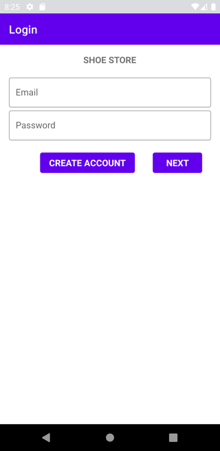
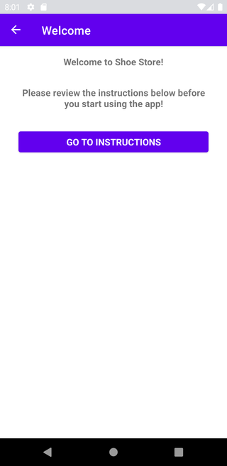
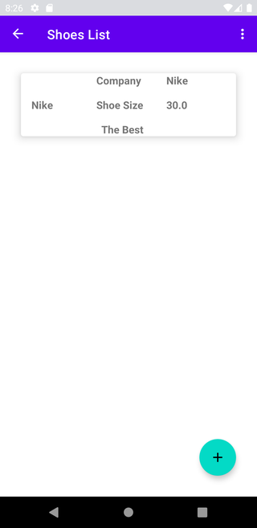

# The Shoe Store

## About this Project

The idea of the App is:

_"Allow the user to create a shoe store inventory as Android Kotlin Developer first assignment"._

## Why?

This project is part of my personal portfolio, so, I'll be happy if you could provide me any feedback about the project, code, structure or anything that you can report that could make me a better developer!

Email-me: harrisonhenrisn@gmail.com

Connect with me at [LinkedIn](https://linkedin.com/in/harrison-henri-dos-santos-nascimento-a6ba33112).

Also, you can use this Project as you wish, be for study, be for make improvements or earn money with it!

It's free!

## Functionalities

- Login with credentials (e.g: E-mail: harrison@gmail.com; password: 123456)



- Welcome page 



- Instructions page 


- Shoe Details page 


- Shoes List page 



## Install

Clone the repo and open with [Android Studio](https://developer.android.com/studio?hl=pt&gclid=CjwKCAjwx6WDBhBQEiwA_dP8rfJ1IFHK0ldtDTs7g4jWKDGx9_sbmGEEMrQ00hjZa5X4RCTPMFRS0RoCSj0QAvD_BwE&gclsrc=aw.ds)

```
$ git clone https://https://github.com/HarrisonHenri/shoe-store
```

## Built With

* [ViewModel](https://developer.android.com/topic/libraries/architecture/viewmodel)
* [LiveData](https://developer.android.com/topic/libraries/architecture/livedata)
* [Data Binding](https://developer.android.com/topic/libraries/data-binding/) with binding adapters
* [Navigation](https://developer.android.com/topic/libraries/architecture/navigation/) with the SafeArgs plugin for parameter passing between fragments
* [Material](https://material.io/develop/android/docs/getting-started) 

## Contributing

You can send how many PR's do you want, I'll be glad to analyse and accept them! And if you have any question about the project...

Email-me: harrisonhenrisn@gmail.com

Connect with me at [LinkedIn](https://linkedin.com/in/harrison-henri-dos-santos-nascimento-a6ba33112).

Thank you!
